# Low-Level Design Problems in Java

A structured learning repository with **50 Low-Level Design problems**, each with complete, runnable Java code. Built for learners who want to deeply understand object-oriented design, architectural patterns, and clean code practices.

---

## The Showcase: Edit. Run. Test. — All in Your Browser.

This repo ships with a **local learning website** (in [website/](website/)) that turns the codebase into an interactive workspace — like LeetCode, but for Low-Level Design. Browse all 50 problems, read the full problem statement and patterns, and **edit + run + test Java code directly in your browser** against your own machine's JDK. No cloud, no signup, no login.



### Run It in 30 Seconds

```bash
cd website
python3 build.py     # scans problems/ and builds data.json
node server.js       # starts the site + the local /api/run endpoint
open http://localhost:8080
```

That's it. Click any problem in the sidebar, hit **Edit**, change the code, click **Run** or **Tests**, and watch the output stream back. Detailed setup, prerequisites, and a recommended learning flow are in [Interactive Website (Local Learning Tool)](#interactive-website-local-learning-tool) below.

> **Browse-only (no execution)?** The site is also hosted at **https://abhj.github.io/lld-learn** — you can browse all problems, view code, read tips, but Run/Tests won't work without a local server.

---

## Interactive Website, With Tests (Local Learning Tool)

The repo ships with a **single-page web app** in [website/](website/) that turns this codebase into an interactive learning environment — like LeetCode, but for LLD. You can browse all 50 problems, read the problem statement and patterns, view source code with syntax highlighting, **edit code in-browser**, **run it**, and **run test cases** — all locally on your machine, no cloud, no signup.

### What You Get

| Feature | What It's For |
|---------|--------------|
| Searchable problem list | Find problems by name or filter by difficulty / design pattern |
| Markdown-rendered README and VARIATIONS | Read the full problem statement and 5 common variations side-by-side with the code |
| Tabbed code viewer | Switch between `naive/`, `optimized/`, and `concurrent/` versions of every file |
| **Edit** (Monaco editor) | Modify any file in the browser — your edits stay in memory until refresh |
| **Run** | Compile and execute the current variant's `Main.java`; stdout/stderr stream back to the page |
| **Tests** | Run the JSON-defined test cases for a problem (e.g., parking-lot has scenarios pre-defined) |
| Progress tracker | Mark problems as "studied" — saved in your browser's localStorage |
| Dark / light theme | Toggle for late-night study |
| Deep links | `http://localhost:8080/#28-url-shortener` jumps straight to a problem |

### Prerequisites

You need **two** things installed in addition to Java (which you already installed above):

| Tool | Why | Install |
|------|-----|---------|
| **Python 3** | Runs `build.py` to scan all problems and generate `data.json` (the data the site reads) | macOS: pre-installed. Ubuntu: `sudo apt install python3`. Windows: https://python.org |
| **Node 18+** | Runs `server.js` — serves the website AND compiles/runs your code on `Run` / `Tests` clicks | macOS: `brew install node`. Ubuntu: `sudo apt install nodejs`. Windows: https://nodejs.org |

Verify both:
```bash
python3 --version    # Python 3.8 or higher
node --version       # v18 or higher
java --version       # 17 or higher (already installed)
```

> **No `npm install` needed.** The Node server uses only built-in modules. The frontend uses CDN-hosted libraries (highlight.js, marked.js, Monaco). Zero dependencies on your machine besides Node + Python + Java.

### Step-by-Step: First-Time Setup

```bash
cd website
```
> **What this does:** Enters the website folder. All commands below assume you're inside `website/`.

```bash
python3 build.py
```
> **What this does:** Scans every `problems/XX-name/` folder, reads each README, VARIATIONS.md, and `.java` source file, and bundles everything into a single `data.json` file the website loads on page load.
> - Run this **once** initially.
> - Re-run it any time you edit a problem's source code or markdown on disk and want the website to reflect those changes.

```bash
node server.js
```
> **What this does:** Starts the local server on port 8080. It does two things at once:
> 1. **Serves static files** — the HTML, CSS, JS, and `data.json` so your browser can load the site.
> 2. **Exposes `POST /api/run`** — when you click **Run** or **Tests** in the browser, the page sends your code here. The server writes it to a temp directory, runs `javac` + `java`, and streams stdout/stderr/exit code back.
>
> Leave this terminal open while you study. `Ctrl+C` to stop.

```bash
# In your browser:
open http://localhost:8080
```

You should see the problem list on the left, a search bar at the top, and the first problem rendered on the right.

### A Suggested Learning Flow

Once the site is running, here's the most effective way to use it:

1. **Pick a problem** from the sidebar (start with [Snake and Ladder](http://localhost:8080/#06-snake-and-ladder), [Tic Tac Toe](http://localhost:8080/#07-tic-tac-toe), or [URL Shortener](http://localhost:8080/#28-url-shortener) — all rated Easy).
2. **Read the Problem Statement** — every problem now has a verbose, scenario-driven description plus Functional/Non-functional Requirements.
3. **Open Main.java first** — it's the entry point and shows how the system is *used*, which is the fastest way to grok the API.
4. **Trace into model/, service/, strategy/** — follow the calls Main makes. The folder names tell you the role (data / business logic / algorithms).
5. **Click Edit** — change a value, add a print statement, swap a strategy. Click **Run**. See the difference in stdout. This is the single biggest thing that builds intuition.
6. **Click Tests** (where available) — the test cases assert on stdout / exit code, so you can see exactly what behavior is expected.
7. **Switch to the `optimized/` tab** — diff it mentally against `naive/`. Read the **Naive vs Optimized** table at the bottom of the problem's README to understand *why* each change was made.
8. **Open the `concurrent/` tab** — see the race condition the naive version has, and the lock-free / CAS / atomic primitives the concurrent version uses to fix it.
9. **Read VARIATIONS.md** — 5 common interview variations of the problem with solution sketches. Try one yourself in the editor.
10. **Mark as studied** — uses the checkbox in the problem header. Resume from where you left off next session.

---

## For Beginners: What You Need

### Install Java

**macOS:**
```bash
brew install openjdk@17
```

**Ubuntu/Debian:**
```bash
sudo apt install openjdk-17-jdk
```

**Windows:**
Download from https://adoptium.net and install. Add `java` to your PATH.

**Verify installation:**
```bash
java --version
# Should show: openjdk 17.x.x or higher
```

### Install Sublime Text (Optional)
Download from https://www.sublimetext.com. Any text editor works.

---

## How to Run Any Problem (Step by Step)

Each problem has two versions: `naive/` (simple) and `optimized/` (production-grade). Open your terminal and run these commands:

```bash
cd problems/01-parking-lot/naive
```
> **What this does:** Navigates to the naive (simple) version of the Parking Lot problem. Replace `naive` with `optimized` to run the production-grade version.

```bash
mkdir -p out
```
> **What this does:** Creates a folder called `out` where compiled files will go. The `-p` flag means "don't error if it already exists."

```bash
javac -d out model/*.java strategy/*.java service/*.java Main.java
```
> **What this does:** Compiles Java files from each subfolder into machine-readable `.class` files.
> - `javac` = Java Compiler (turns `.java` → `.class`)
> - `-d out` = "put compiled output in the `out` directory"
> - `model/*.java` = compile all model (entity) files
> - `strategy/*.java` = compile all strategy (algorithm) files
> - `service/*.java` = compile all service (business logic) files
> - `Main.java` = compile the entry point
>
> **Note:** Some problems have additional folders like `state/`, `command/`, `observer/`. Check the problem's README for the exact command.

```bash
java -cp out Main
```
> **What this does:** Runs the compiled program, starting from the `Main` class.
> - `java` = Java Runtime (executes compiled code)
> - `-cp out` = "look for compiled classes in the `out` folder" (cp = classpath)
> - `Main` = the class containing `public static void main(String[] args)` — the program's entry point

**That's it.** Every problem's README has the exact compile command for that specific problem.

---

## Using Sublime Text

1. Open Sublime Text
2. Go to **Project → Open Project…** → select `.sublime/lld-problems.sublime-project`
3. Navigate to any problem's `src/Main.java`
4. Press **Cmd+B** (macOS) or **Ctrl+B** (Windows/Linux) to compile and run

| Shortcut | What Happens |
|----------|-------------|
| `Cmd+B` | Compiles all `.java` files and runs `Main` |
| `Cmd+Shift+B` → "Compile Only" | Only compiles, doesn't run |

---

## Project Structure

```
lld-problems-java/
├── .sublime/                      ← Sublime Text project config
├── website/                       ← Interactive learning website
├── README.md                      ← You are here
└── problems/
    └── 01-parking-lot/
        ├── README.md              ← Problem description, patterns, comparison table
        ├── VARIATIONS.md          ← 5 common variations with solution sketches
        ├── naive/                 ← Simple/brute-force version (learn concepts)
        │   ├── model/             → Data classes: Vehicle, ParkingSpot, Ticket
        │   ├── service/           → Business logic: ParkingLot, ParkingLevel
        │   ├── strategy/          → Algorithms: PricingStrategy, HourlyPricing
        │   └── Main.java          → Entry point — run this
        └── optimized/             ← Production-grade (O(1) lookups, lock-free)
            ├── model/
            ├── service/
            ├── strategy/
            └── Main.java
```

### Understanding the Folders (Layers)

The **directory name IS the layer**. No comments needed — the folder tells you the role:

| Folder | Role | What Goes Here |
|--------|------|---------------|
| **model/** | Data and entities — the "things" in your system | `Vehicle`, `Ticket`, `Player`, `Card`, enums |
| **service/** | Business logic — the "actions" and "rules" | `ParkingLot`, `GameController`, `BookingSystem` |
| **strategy/** | Interchangeable algorithms | `PricingStrategy`, `MatchingStrategy` |
| **state/** | Behavior that changes based on current state | `IdleState`, `MovingState`, `DispensingState` |
| **command/** | Encapsulated actions (supports undo/redo) | `MoveCommand`, `InsertCommand` |
| **observer/** | Event listeners | `OrderListener`, `AlertHandler` |
| **Main.java** | Entry point — demonstrates the system | Always at the root of naive/ or optimized/ |

This maps to real-world architecture:
- **model/** = MVC's "Model" layer
- **service/** = MVC's "Controller" layer (business logic)
- **strategy/state/command/** = Design pattern implementations
- **Main.java** = Application driver (like a "View" that prints results)

### Why Two Versions?

| | `naive/` | `optimized/` |
|--|----------|-------------|
| **Purpose** | Learn the design patterns and structure | Learn performance engineering |
| **Data structures** | ArrayList, HashMap basics | ConcurrentHashMap, PriorityQueue, AtomicReference |
| **Time complexity** | Often O(n) — simple but slow | O(1) or O(log n) where it matters |
| **Thread safety** | `synchronized` blocks | Lock-free (CAS), dedicated concurrent collections |
| **Architecture** | Sometimes Singleton, tight coupling | Dependency injection, testable design |
| **When to study** | First pass — understand the domain | Second pass — optimize for production |

---

## Problem Index

| # | Problem | Core Patterns | Difficulty |
|---|---------|--------------|------------|
| 01 | [Parking Lot](problems/01-parking-lot/) | Strategy, Factory, Singleton, Observer | Medium |
| 02 | [Elevator System](problems/02-elevator-system/) | State, Strategy, Observer | Hard |
| 03 | [Library Management](problems/03-library-management/) | Repository, Observer, Strategy | Medium |
| 04 | [Vending Machine](problems/04-vending-machine/) | State, Strategy | Medium |
| 05 | [Traffic Signal](problems/05-traffic-signal/) | State, Observer, Mediator | Medium |
| 06 | [Snake and Ladder](problems/06-snake-and-ladder/) | Template Method, Strategy, Factory | Easy |
| 07 | [Tic Tac Toe](problems/07-tic-tac-toe/) | Strategy, Command | Easy |
| 08 | [Chess Game](problems/08-chess-game/) | Strategy, Factory, Command | Hard |
| 09 | [Hotel Management](problems/09-hotel-management/) | Strategy, State, Observer, Factory | Hard |
| 10 | [Movie Ticket Booking](problems/10-movie-ticket-booking/) | Strategy, Observer, Factory | Medium |
| 11 | [ATM Machine](problems/11-atm-machine/) | State, Chain of Responsibility | Medium |
| 12 | [Car Rental System](problems/12-car-rental-system/) | Strategy, Factory, Builder | Medium |
| 13 | [Food Delivery](problems/13-food-delivery/) | Observer, Strategy, State | Hard |
| 14 | [Ride Sharing](problems/14-ride-sharing/) | Strategy, Observer, State | Hard |
| 15 | [Social Media Feed](problems/15-social-media-feed/) | Observer, Strategy, Iterator | Medium |
| 16 | [Notification System](problems/16-notification-system/) | Observer, Strategy, Factory, Decorator | Medium |
| 17 | [Logging Framework](problems/17-logging-framework/) | Singleton, Chain of Responsibility, Decorator | Medium |
| 18 | [Cache System (LRU/LFU)](problems/18-cache-system/) | Strategy, Decorator | Medium |
| 19 | [Pub-Sub System](problems/19-pub-sub-system/) | Observer, Mediator | Medium |
| 20 | [Task Scheduler](problems/20-task-scheduler/) | Strategy, Command, Observer | Hard |
| 21 | [File System](problems/21-file-system/) | Composite, Iterator, Visitor | Medium |
| 22 | [Spreadsheet](problems/22-spreadsheet/) | Observer, Command, Memento | Hard |
| 23 | [Splitwise](problems/23-splitwise/) | Strategy, Observer | Medium |
| 24 | [Online Auction](problems/24-online-auction/) | Observer, State, Strategy | Medium |
| 25 | [Stock Exchange](problems/25-stock-exchange/) | Observer, Strategy, Mediator | Hard |
| 26 | [Payment Gateway](problems/26-payment-gateway/) | Strategy, Chain of Responsibility, Adapter | Hard |
| 27 | [Rate Limiter](problems/27-rate-limiter/) | Strategy, Decorator | Medium |
| 28 | [URL Shortener](problems/28-url-shortener/) | Factory, Strategy | Easy |
| 29 | [Key-Value Store](problems/29-key-value-store/) | Strategy, Proxy, Command | Medium |
| 30 | [Connection Pool](problems/30-connection-pool/) | Object Pool, Singleton, Factory | Medium |
| 31 | [Thread Pool](problems/31-thread-pool/) | Object Pool, Command | Hard |
| 32 | [Producer-Consumer](problems/32-producer-consumer/) | Observer, Strategy | Medium |
| 33 | [Event Bus](problems/33-event-bus/) | Observer, Mediator | Medium |
| 34 | [Circuit Breaker](problems/34-circuit-breaker/) | State, Proxy | Medium |
| 35 | [Object Pool](problems/35-object-pool/) | Object Pool, Factory | Medium |
| 36 | [Command Pattern Editor](problems/36-command-pattern-editor/) | Command, Memento, Composite | Medium |
| 37 | [State Machine](problems/37-state-machine/) | State, Builder | Medium |
| 38 | [Restaurant Ordering](problems/38-restaurant-ordering/) | Observer, State, Command | Medium |
| 39 | [Airline Reservation](problems/39-airline-reservation/) | Strategy, Observer, State | Hard |
| 40 | [Inventory Management](problems/40-inventory-management/) | Observer, Strategy, Command | Medium |
| 41 | [Chat Application](problems/41-chat-application/) | Observer, Mediator | Medium |
| 42 | [Calendar System](problems/42-calendar-system/) | Observer, Strategy, Builder | Medium |
| 43 | [Document Editor](problems/43-document-editor/) | Command, Memento, Observer | Hard |
| 44 | [Music Player](problems/44-music-player/) | State, Strategy, Iterator | Medium |
| 45 | [Shopping Cart](problems/45-shopping-cart/) | Strategy, Decorator | Medium |
| 46 | [Order Management](problems/46-order-management/) | State, Observer, Strategy | Medium |
| 47 | [Conference Room Booking](problems/47-conference-room-booking/) | Strategy, Observer | Medium |
| 48 | [Pizza Delivery](problems/48-pizza-delivery/) | Builder, Decorator, State | Medium |
| 49 | [Vehicle Tracking](problems/49-vehicle-tracking/) | Observer, Strategy, State | Medium |
| 50 | [Card Game - Blackjack](problems/50-card-game-blackjack/) | Strategy, State, Template Method | Medium |

---

## Design Patterns — When to Use What

| Pattern | In Plain English | Real-World Analogy |
|---------|-----------------|-------------------|
| **Strategy** | "I want to swap out HOW something is done without changing the rest." | A GPS app letting you choose "fastest route" vs "shortest route" vs "avoid tolls" |
| **Observer** | "When something changes, automatically notify everyone who cares." | Subscribing to a YouTube channel — you get notified of new videos |
| **State** | "The object behaves differently depending on what state it's in." | A traffic light — same light, different behavior when RED vs GREEN |
| **Factory** | "Let someone else decide which specific object to create." | Ordering "a coffee" — the barista decides whether to make espresso, latte, etc. |
| **Singleton** | "There should be exactly ONE of this in the entire system." | A country has one president at a time |
| **Command** | "Wrap an action as an object so you can undo it, queue it, or log it." | A restaurant order slip — you can cancel it, reorder it, track it |
| **Decorator** | "Add extra behavior to an object without changing its class." | Adding toppings to ice cream — same cone, extra stuff on top |
| **Builder** | "Construct a complex object step by step." | Ordering a custom sandwich — choose bread, then meat, then sauce |
| **Composite** | "Treat a group of objects the same as a single object." | A file system — a folder contains files AND other folders |
| **Chain of Responsibility** | "Pass a request along a chain until someone handles it." | Customer support escalation — agent → supervisor → manager |
| **Mediator** | "Instead of everyone talking to everyone, talk through a coordinator." | Air traffic control — planes don't talk to each other directly |
| **Memento** | "Save a snapshot so you can restore it later." | Ctrl+Z (undo) — saves previous state |
| **Iterator** | "Go through a collection one item at a time without knowing the internals." | A TV remote's "next channel" button |
| **Proxy** | "A stand-in that controls access to the real thing." | A security guard checking ID before letting you into a building |
| **Template Method** | "Define the skeleton of an algorithm; let subclasses fill in the details." | A recipe — steps are fixed, but ingredients vary |
| **Adapter** | "Make two incompatible interfaces work together." | A power adapter for international outlets |
| **Object Pool** | "Reuse expensive objects instead of creating new ones each time." | A library — books are borrowed and returned, not bought and thrown away |

---

## SOLID Principles (In Plain English)

| Principle | One-Liner | Example |
|-----------|-----------|---------|
| **S**ingle Responsibility | A class does ONE thing well. | `PricingStrategy` only calculates price. It doesn't also park cars. |
| **O**pen/Closed | Add new behavior WITHOUT editing existing code. | Add a new `WeekendPricing` strategy without touching `ParkingLot`. |
| **L**iskov Substitution | Subclasses can replace their parent anywhere. | `Car` can go anywhere `Vehicle` is expected. |
| **I**nterface Segregation | Don't force classes to implement methods they don't use. | A `Readable` interface and a `Writable` interface, not one giant `ReadWriteDeleteCopy` interface. |
| **D**ependency Inversion | Depend on abstractions, not specifics. | `ParkingLot` depends on `PricingStrategy` (interface), not `HourlyPricing` (concrete class). |

---

## LLD Interview Playbook — How to Approach a Coding-Round LLD Question

A 45–60-minute LLD interview is **not** a competitive-programming question. The interviewer is grading three things: (1) can you turn a vague requirement into a clean object model, (2) do you make sensible trade-offs out loud, and (3) is the code you produce extensible? You can ace LeetCode and still fail this round if you start typing too early.

### The 7-Step Framework — Use This for Every Problem

| # | Step | Time | What You Do | What You Say Out Loud |
|---|------|------|------------|----------------------|
| 1 | **Clarify scope** | 3–5 min | Ask 3–5 questions to nail down what's in / out of scope. Don't assume. | *"How many vehicle types? Multi-level? Pricing fixed or pluggable? Concurrent entries?"* |
| 2 | **List functional requirements** | 2 min | Write 4–6 bullets of *what the system does*. Read them back. | *"Park, unpark, calculate fee, find available spot, notify on full."* |
| 3 | **List non-functional requirements** | 2 min | Scale, concurrency, latency, extensibility. Even one bullet shows seniority. | *"Should support concurrent entries; pricing must be swappable without modifying core."* |
| 4 | **Identify entities (nouns)** | 5 min | Underline nouns in the requirements. Those are your classes. | *"Vehicle, ParkingSpot, Ticket, Level, ParkingLot, PricingStrategy."* |
| 5 | **Identify operations (verbs)** | 3 min | Verbs become methods on the right entity. | *"`park` lives on ParkingLot, not Vehicle. `calculatePrice` lives on PricingStrategy."* |
| 6 | **Sketch the API + classes** | 10 min | Method signatures first. Fields follow. Patterns emerge naturally — don't force them. | *"I'll use Strategy here because pricing is pluggable. Singleton on ParkingLot."* |
| 7 | **Code the core flow** | 15–20 min | Implement Main + the happy path. Stub edge cases as comments. | *"I'll skip the persistence layer — let me know if you want it."* |

### What Interviewers Actually Score

| Signal | What Earns Points | What Loses Points |
|--------|------------------|------------------|
| **Clarification** | Asks 3–5 sharp questions before coding | Starts coding immediately |
| **Vocabulary** | Says "Strategy", "Open/Closed", "race condition", "linearizability" | Generic "I'll just use a HashMap" without justification |
| **Trade-offs** | "I picked HashMap over TreeMap because lookups are 10x more frequent than range queries" | Silent choices |
| **Extensibility** | Adds an interface where future variation is likely (pricing, notifications, matching) | Hard-codes everything as `if/else` chains |
| **Concurrency awareness** | Spots the race condition unprompted, even if they don't fix it | "Yeah, threads, sure" hand-wave |
| **Code quality** | Small classes, single responsibility, meaningful names | 200-line god classes named `Manager` |
| **Honesty** | "I'm not sure — I'd reach for X but verify with a benchmark" | Bluffing |

### Cheat Sheet — Pattern by Symptom

When you hear this in the question, reach for this pattern:

| Requirement signal | Pattern | Real example in this repo |
|-------------------|---------|--------------------------|
| "Pluggable rules / algorithms" | **Strategy** | [Parking pricing](problems/01-parking-lot/), [splitwise split](problems/23-splitwise/) |
| "Different behavior in different states" | **State** | [Elevator](problems/02-elevator-system/), [Vending Machine](problems/04-vending-machine/), [ATM](problems/11-atm-machine/) |
| "Notify subscribers / listeners" | **Observer** | [Pub-Sub](problems/19-pub-sub-system/), [Auction outbid alerts](problems/24-online-auction/) |
| "Undo / redo / replay" | **Command** + **Memento** | [Document Editor](problems/43-document-editor/), [Spreadsheet](problems/22-spreadsheet/) |
| "Tree of things treated uniformly" | **Composite** | [File System](problems/21-file-system/) |
| "One global instance" | **Singleton** | Use sparingly — only when truly one (logger, config) |
| "Wrap an object to add behavior" | **Decorator** | [Notification channels](problems/16-notification-system/), [Cache TTL](problems/18-cache-system/) |
| "Caller shouldn't know which subclass to make" | **Factory** | [Vehicle creation](problems/12-car-rental-system/) |
| "Build a complex object step by step" | **Builder** | [Pizza Delivery](problems/48-pizza-delivery/) |
| "Coordinate many objects without N×N coupling" | **Mediator** | [Chat Application](problems/41-chat-application/), [Stock Exchange](problems/25-stock-exchange/) |
| "Pass request through a series of handlers" | **Chain of Responsibility** | [Payment validation](problems/26-payment-gateway/), [Logger levels](problems/17-logging-framework/) |
| "Reuse expensive objects" | **Object Pool** | [Connection Pool](problems/30-connection-pool/), [Thread Pool](problems/31-thread-pool/) |
| "Wrap an incompatible interface" | **Adapter** | Third-party SDKs |
| "Fixed skeleton, swappable steps" | **Template Method** | [Snake & Ladder](problems/06-snake-and-ladder/), [Blackjack](problems/50-card-game-blackjack/) |

### Top 10 Mistakes to Avoid

1. **Coding before clarifying.** The single most common mistake. Even 60 seconds of clarification saves you 10 minutes of rework.
2. **God classes named `Manager`, `Helper`, `Util`.** A class with 15 unrelated methods is a violation of SRP and a sign you didn't decompose.
3. **Inheritance for code reuse.** Use composition. Inherit only when there is genuine *is-a* substitutability (Liskov).
4. **Premature abstraction.** Don't add a `Strategy` for one algorithm "just in case." Add it when the requirement says "different rules" or the interviewer hints at extension.
5. **Ignoring concurrency entirely.** If the interviewer mentions "many users", "real-time", or "high traffic", they want to hear *something* about thread safety — at minimum, name the data structure.
6. **Silent decisions.** Saying nothing while you type makes you look like you're guessing. Narrate: *"I'm picking a `ConcurrentHashMap` here because…"*
7. **Forgetting the question's verbs.** Every requirement verb (park, unpark, calculate, notify) must map to a method. If it doesn't, you missed a feature.
8. **Premature optimization.** "I'd use a Bloom filter" before you've drawn a single class is a red flag, not a green one. Get the model right first.
9. **No `Main` / no demo.** Always end with a runnable `main()` that exercises the happy path. It proves your design *works*, not just that it compiles.
10. **Defensive null-checks everywhere.** Use `Optional`, immutable objects, and trust internal contracts. Validate at the boundary, not in every method.

### Phrases That Make You Sound Senior

- *"I'd start with the simplest design that satisfies the requirement, then extract a Strategy if the rules need to vary."*
- *"This is a read-heavy workload, so I'll bias toward a structure with O(1) lookups and accept O(log n) writes."*
- *"To keep this thread-safe without a global lock, I'd reach for a `ConcurrentHashMap` and CAS on the value."*
- *"That violates the Open/Closed principle — let me extract an interface here."*
- *"I'd add an interface even though there's only one implementation today, because the requirement explicitly says 'pluggable'."*
- *"There's a race condition between checking and inserting — I'd use `putIfAbsent` to make it atomic."*
- *"I'm trading memory for latency here. If the interviewer cares about footprint, I'd switch to lazy evaluation."*
- *"That's an instance of the Composite pattern — files and folders are both `FileSystemEntry`."*
- *"I'd push that responsibility into a separate `NotificationService` — it's not the parking lot's job."*
- *"For the MVP I'd skip persistence; if asked, I'd add a `Repository` interface and inject it."*

### Time Budget for a 45-Minute Round

| Phase | Time | Output |
|-------|------|--------|
| Clarify + requirements | 5 min | A bulleted list both you and the interviewer agree on |
| Entities + class diagram | 10 min | A whiteboard / shared doc with classes, fields, methods |
| Core implementation | 20 min | Working `Main` + 2–3 core classes |
| Walkthrough + edge cases | 5 min | "Here's how I'd handle X… and Y…" |
| Buffer | 5 min | For follow-ups: "How would you scale this?" |

> **Pro tip:** If you're at minute 20 and still drawing the class diagram, that's *good* — it means you're not coding spaghetti. If you're at minute 20 and 200 lines deep with no design done, that's bad.

### Recommended Practice Order from This Repo

1. **Warm-up (Easy):** [URL Shortener](problems/28-url-shortener/), [Snake & Ladder](problems/06-snake-and-ladder/), [Tic Tac Toe](problems/07-tic-tac-toe/) — small surface, lets you focus on the framework above.
2. **Bread-and-butter (Medium):** [Parking Lot](problems/01-parking-lot/), [ATM](problems/11-atm-machine/), [Cache System](problems/18-cache-system/), [Rate Limiter](problems/27-rate-limiter/), [Splitwise](problems/23-splitwise/) — these come up in 70% of interviews.
3. **Concurrency-flavored (Medium-Hard):** [Connection Pool](problems/30-connection-pool/), [Producer-Consumer](problems/32-producer-consumer/), [Thread Pool](problems/31-thread-pool/), [Auction](problems/24-online-auction/), [Payment Gateway](problems/26-payment-gateway/) — the differentiator at senior+.
4. **Heavy domains (Hard):** [Elevator](problems/02-elevator-system/), [Chess](problems/08-chess-game/), [Stock Exchange](problems/25-stock-exchange/), [Spreadsheet](problems/22-spreadsheet/), [Document Editor](problems/43-document-editor/) — practice these only after you can handle the framework with smaller problems.

For each one: do `naive/` first to get the design right, then `optimized/` to learn the production tricks, then `concurrent/` to learn the thread-safety patterns. Read `VARIATIONS.md` last — it's your interviewer's likely follow-up.

---

## Java Concurrency Primitives — Quick Reference

This section covers the concurrent classes and methods used across the 50 problems. Examples use the Parking Lot domain where possible.

### 1. Field Modifiers for Thread Safety

| Modifier | Meaning | Use When | Example |
|----------|---------|----------|---------|
| `final` | Reference never changes after constructor | Safe publication; immutable fields | `final String licensePlate;` |
| `volatile` | Always reads latest value from main memory | One writer, many readers; flags | `volatile boolean isOpen;` |
| `static` | Belongs to class, not instance | Shared across all objects | `static int totalCars;` |
| `static final` | Class-level constant | One copy, never reassigned | `static final int MAX_FLOORS = 5;` |
| `private` | Encapsulation | Force access through synchronized methods | `private Map<String, Ticket> tickets;` |

### 2. AtomicReference<T> Methods

```java
AtomicReference<Vehicle> spot = new AtomicReference<>(null);

// compareAndSet — "if currently null, park myCar atomically"
boolean parked = spot.compareAndSet(null, myCar);   // true if spot was empty

// getAndSet — "atomically take the spot, return whoever was there"
Vehicle prev = spot.getAndSet(newCar);              // returns old occupant (or null)

// get — "read current occupant"
Vehicle current = spot.get();

// set — "unconditionally overwrite (not atomic with any check)"
spot.set(null);  // use only when you already hold exclusive access
```

### 3. AtomicInteger / AtomicLong Methods

```java
AtomicInteger available = new AtomicInteger(100);

int n = available.decrementAndGet();   // --x atomically, returns new value
int m = available.incrementAndGet();   // ++x atomically, returns new value
int old = available.getAndIncrement(); // x++ atomically, returns OLD value

// compareAndSet — "only decrement if we see expected value"
available.compareAndSet(50, 49);       // true if current was 50

int val = available.get();             // read current
available.set(100);                    // unconditional write
```

### 4. ConcurrentHashMap Methods

```java
ConcurrentHashMap<String, Ticket> tickets = new ConcurrentHashMap<>();

tickets.put(plate, ticket);                          // thread-safe put
Ticket t = tickets.get(plate);                       // thread-safe get
tickets.putIfAbsent(plate, ticket);                  // only put if key missing
tickets.computeIfAbsent(plate, k -> new Ticket(k)); // get or create atomically
tickets.compute(plate, (k, v) -> v.markPaid());      // atomic read-modify-write
tickets.remove(plate);                               // thread-safe remove
```

### 5. ConcurrentLinkedQueue Methods

```java
ConcurrentLinkedQueue<ParkingSpot> freeSpots = new ConcurrentLinkedQueue<>();

freeSpots.offer(spot);       // add to tail — always succeeds, lock-free
ParkingSpot s = freeSpots.poll();  // remove from head — returns null if empty, lock-free
ParkingSpot p = freeSpots.peek();  // look at head without removing
```

All operations are O(1) and lock-free — threads never block each other.

### 6. CopyOnWriteArrayList

```java
CopyOnWriteArrayList<Observer> listeners = new CopyOnWriteArrayList<>();
```

- **Use when:** many readers, rare writers (e.g., observer/listener lists).
- **How it works:** every write clones the entire internal array — readers see a stable snapshot and never block.
- **Trade-off:** writes are expensive (full copy), reads are instant and lock-free.

### 7. CountDownLatch

```java
CountDownLatch ready = new CountDownLatch(3);  // 3 threads must check in

// In each worker thread:
ready.countDown();   // "I'm ready" — decrements count by 1

// In the coordinator:
ready.await();       // blocks until count hits 0 — then all threads proceed
```

Use case: ensure all threads reach a starting line before racing simultaneously (load tests, simulations).

### 8. ReentrantLock / ReentrantReadWriteLock

```java
ReentrantLock lock = new ReentrantLock();
lock.lock();
try {
    // critical section
} finally {
    lock.unlock();  // ALWAYS unlock in finally
}

ReentrantReadWriteLock rwLock = new ReentrantReadWriteLock();
rwLock.readLock().lock();   // many readers allowed simultaneously
rwLock.writeLock().lock();  // exclusive — blocks all readers and writers
```

Use over `synchronized` when you need: tryLock (non-blocking attempt), interruptible locking, or read/write separation.

### 9. Semaphore

```java
Semaphore permits = new Semaphore(10);  // e.g., 10 DB connections

permits.acquire();  // take a permit — blocks if none available
try {
    // use the resource
} finally {
    permits.release();  // return the permit
}
```

Use case: limit concurrent access to a fixed-size resource pool (connection pools, object pools, rate limiters).

### 10. BlockingQueue (LinkedBlockingQueue)

```java
BlockingQueue<Task> queue = new LinkedBlockingQueue<>(100);

queue.put(task);        // blocks if queue is full (backpressure)
Task t = queue.take();  // blocks if queue is empty (waits for work)
```

Use case: producer-consumer pattern — producers `put`, consumers `take`, the queue handles all synchronization.

---

## How to Study These Problems

### Recommended Order for Beginners
1. Start with **Easy**: 06, 07, 28
2. Move to **Medium (simple domains)**: 01, 04, 11, 17, 27
3. Then **Medium (complex domains)**: 13, 14, 23, 25
4. Finally **Hard**: 02, 08, 20, 22, 31

### For Each Problem
1. Read the README.md — understand the requirements
2. Look at Main.java FIRST — see how the system is used
3. Trace through the code from Main.java into other files
4. Identify which layer each file belongs to
5. Ask: "What design pattern is this? Why was it chosen?"
6. Read VARIATIONS.md — understand how the problem evolves
7. Try implementing a variation yourself

---

### Read-Only Mode (No Code Execution)

If you don't want to install Node and just want to browse the site, you can use Python's built-in HTTP server:

```bash
cd website
python3 build.py
python3 -m http.server 8080
# Open http://localhost:8080
```

You'll get the full UI — search, filter, code viewer, dark mode, progress tracker — but the **Run** and **Tests** buttons will fail because there's no `/api/run` endpoint without `node server.js`. Use this mode if you only want to *read* code, not *execute* it from the browser. You can always run problems from the terminal directly using the commands in [How to Run Any Problem](#how-to-run-any-problem-step-by-step).

### When to Re-run `build.py`

`data.json` is a *snapshot* of the repo, not a live view. You need to re-run `python3 build.py` and refresh the browser whenever:

- You edit a problem's `.java` files **on disk** (edits made through the in-browser editor don't need a rebuild — they live in memory).
- You change a README.md or VARIATIONS.md.
- You add a new problem folder.

The Node server itself does **not** need to be restarted on rebuild — just refresh the browser tab.

### Common Issues

| Symptom | Likely Cause | Fix |
|---------|-------------|-----|
| `Cannot find module` when running `node server.js` | Node version too old | Upgrade to Node 18+ |
| Run button shows "API unavailable" | Using `python3 -m http.server` instead of `node server.js` | Switch to `node server.js` for execution |
| Compilation errors when clicking Run | `java` / `javac` not on PATH | Run `java --version` to verify; reinstall JDK if missing |
| Empty problem list | Forgot to run `python3 build.py` | Run it from inside `website/`; refresh browser |
| Port 8080 already in use | Another app is using the port | Stop the other app, or edit `server.js` to use a different port |
| Edits disappeared on refresh | In-browser edits are intentionally in-memory | To persist, edit the file on disk and re-run `build.py` |

### Why Use the Website Instead of Just `cd` + `javac`?

Both work — the terminal flow in [How to Run Any Problem](#how-to-run-any-problem-step-by-step) is fully self-contained. The website adds:

- **Faster iteration** — edit code, click Run, see output, repeat. No `cd`, no `mkdir out`, no remembering which subfolders to compile.
- **Side-by-side reading** — markdown + code in one viewport, with Monaco's syntax highlighting and code folding.
- **Variant comparison** — one-click toggle between `naive/`, `optimized/`, and `concurrent/` of the same file.
- **Progress tracking** — knows what you've already studied across sessions.

If you're comfortable in the terminal, both are equally fine. The website is here to lower the friction so you can focus on the *design*, not the `javac` invocation.

---

## Quick Reference: Compile and Run

```bash
# Run the naive (simple) version:
cd problems/XX-problem-name/naive
mkdir -p out
javac -d out model/*.java strategy/*.java service/*.java Main.java
java -cp out Main

# Run the optimized (production) version:
cd problems/XX-problem-name/optimized
mkdir -p out
javac -d out model/*.java strategy/*.java service/*.java Main.java
java -cp out Main
```

| Command | What It Does |
|---------|-------------|
| `cd problems/XX/naive` | Navigate to the simple version (or `optimized/` for the better one) |
| `mkdir -p out` | Create output folder (safe to run multiple times) |
| `javac -d out model/*.java ...` | Compile Java files from each subfolder → `out/` |
| `java -cp out Main` | Run the program starting from `Main` class |

> **Tip:** Each problem's README has the exact `javac` command with the correct subfolder list for that problem.

---
*Copyright (c) 2026 Abhijay (abj). All rights reserved. Unauthorized copying, modification, or distribution prohibited.*
